# Duinotech Uno Programmer

Recently, we had to program a big pile of Uno's for some workshops we were running, getting kids to build the [Snake Game Project](https://jaycar.com.au/snake-game) . We didn't want to worry the kids with the programming side of it, so we needed a pile of preprogrammed Uno's for them to build with. The idea of using an Uno to program an Uno sounds a bit meta, but with a USB Host Shield, we managed to program our Uno's. In fact, the programming only takes about three seconds per board, which is even faster than we could unpack them. Some soldering required.

## Shopping List:

|Qty| Code | Description |
|---|---|---|
|1 | [XC4410](http://jaycar.com.au/p/XC4410) | Uno Main board
|1 | [XC4456](http://jaycar.com.au/p/XC4456) | USB Host shield
|1 | [XC4482](http://jaycar.com.au/p/XC4482) | Prototyping shield
|1 | [ZD0150](http://jaycar.com.au/p/ZD0150) | Red LED
|3 | [ZD0170](http://jaycar.com.au/p/ZD0170) | Green LED
|1 | [RR0564](http://jaycar.com.au/p/RR0564) | 470 resistor pack
|1 | [SP0720](http://jaycar.com.au/p/SP0720) | Red pushbutton


## Construction:

The button is used to start the process and LEDs are mostly to give an idea of whether the programming is proceeding correctly, and could be replaced by components on a breadboard or even just a jumper wire connected to D3 to start the process. To build the shield, we did the following. Start by mounting the buttons and LEDs as shown. The position isn't critical, but because we're using the component legs under the board, they might not be long enough if the position changes. Don't trim the legs yet! Note that the anodes (long leg, without the flat) are facing towards the digital pins (top of picture).

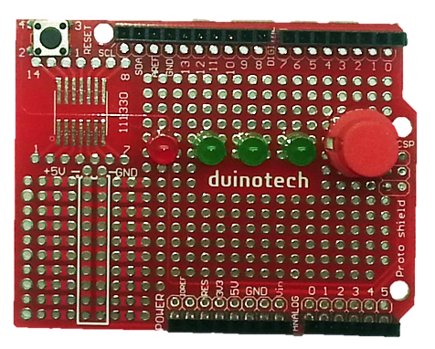

Flip the board over, and solder the anodes to their respective pins, D4-D6 for the green LEDs and D7 for the red LED. Solder the cathodes and cut them off, saving them for making connections later, including D3 for the switch.

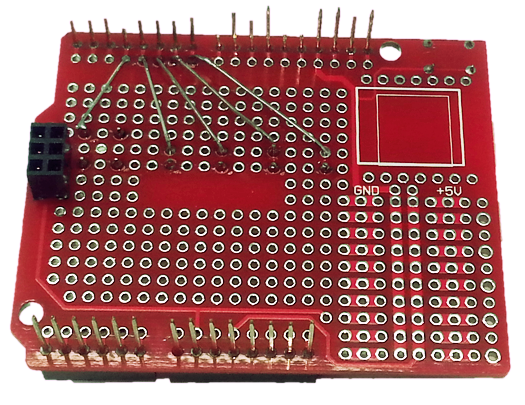

The resistors are next, one for each LED. Again, solder in place, but do not trim.

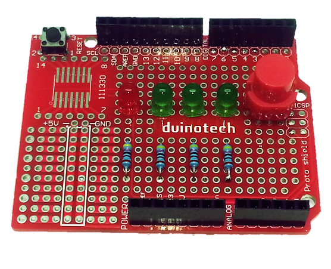

Now connect the loose ends of the resistors, with the other ends all going to ground.

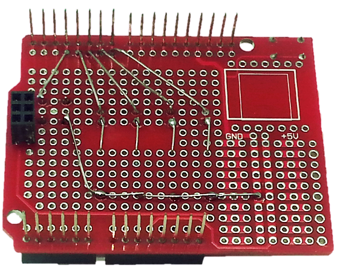

This is all the soldering that is needed. All that is left is to put the USB Host Shield on top of the Uno, and the plug the assembled Prototyping Shield into the top of the USB Host Shield.

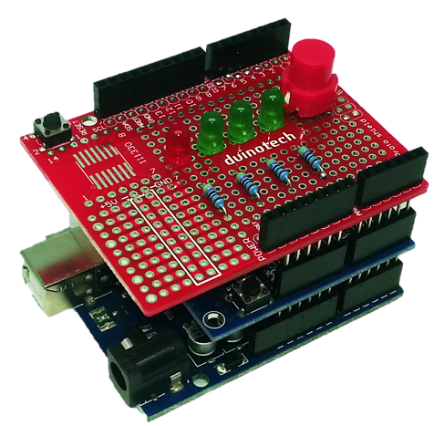

## Connections:

The following is a summary of the connections that have been made. The connections on the USB Host shield cannot be easily changed, but are good to know in case you need to modify the project.

|Uno|Proto Shield|USB Host Shield
|---|---|---
|D3|To GND via Button| |
|D4|To GND via green LED and resistor| |
|D5|To GND via green LED and resistor| |
|D6|To GND via green LED and resistor||
|D7|To GND via red LED and resistor||
|D9||INT
|D10||SS
|D11||MOSI
|D12||MISO
|D13||SCK

## Sketch:

The sketch that is uploaded to the programmer actually includes a copy of the sketch code that programmed to the second Uno. In the code we have supplied, this is the Snake Game, but later we'll show you how to change this. There is one library needed to make the project work, for the USB Host Shield, and this can be installed via the Library Manager. Go to Sketch>Include Library>Manage Libraries and search for 'usb host' (with a space), and install the 'USB Host Shield Library 2.0' as seen below.

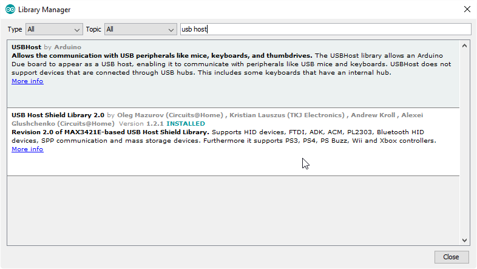

The sketch is based heavily on the 'acm_terminal' example from this library. After the library is installed, it should simply be a case of selecting the Uno board and serial port and clicking upload. To test, plug a second Uno into the USB Host shield's socket, and press the button. If everything is working, the three green LEDs should light up in quick succession.

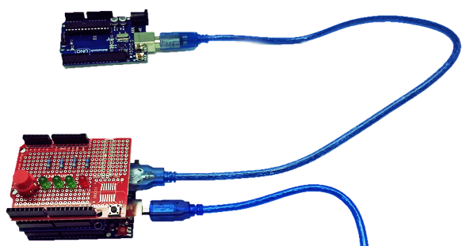

If you have it hooked up to a computer, the serial monitor (115200 baud) will give more detailed information. If you are having issues, be aware of the following. This project will only work on Uno boards that have a 16u2 IC as USB-Serial converter. The duinotech Uno is an example that will work. Some Uno boards use a different USB-Serial converter, and the sketch does not recognize this. Other main boards such as the Mega and Leonardo will not work because they use a different upload protocol, and have a different device ID.

The sketch provides a minimal interface which interacts with the bootloader and performs three main functions, which correspond to the three green LEDs. The first is to reset and check the correct bootloader is responding. The second is to upload the sketch code, and the third is to verify the sketch code. If only one or two LEDs light up, then this will give some indication of where the process is failing.

## Changing the Target Sketch:

Once you have determined that the default sketch is working correctly, you can modify it to upload a different target sketch. The first proviso is to ensure that the target sketch is below 17004 bytes (under Arduino 1.6.7- different versions may compile to slightly different sizes), as the main sketch is 15252 bytes, and both need to be less than the available flash memory of 32256 bytes. This can be checked when compiling on the status window:

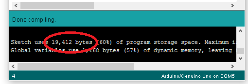

This is actually the output from compiling the Duinotech Uno Programmer sketch (with Snake Game as target). Upload the target sketch to an Uno via the computer, and then connect it to the Duinotech Uno Programmer. There is a function available via the serial monitor to read out the flash contents, so open the serial monitor at 115200 baud, and type '~' and press Enter. The target Uno will be read and its flash memory contents displayed as an array.

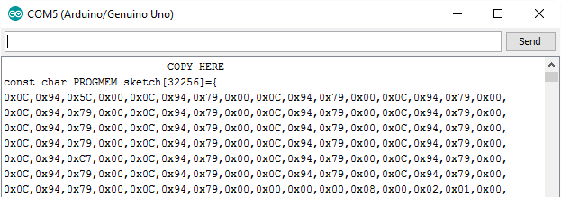

Note that the whole memory is read, even if the sketch is less than 32256 bytes. Each line is 16 bytes and we only need to keep the number of bytes mentioned by the compiler above, which will vary depending on your target sketch. It may help to paste the data into a spreadsheet program to help count the lines. The other important thing is that the number of bytes in [] should equal the number of bytes in the array. Then replace the entire contents of the 'sketch.h' file (the second tab) with the new data.

Another option is to use the 'Export Compiled Binary' option (Sketch>Export Compiled Binary) and convert this using an Excel spreadsheet that we have created. This will save two .hex files in the sketch folder (where the sketch is saved). Open the one without bootloader in a text editor such as Wordpad.

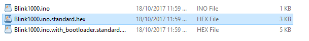

And copy and paste the text into cell A2 of the spreadsheet.

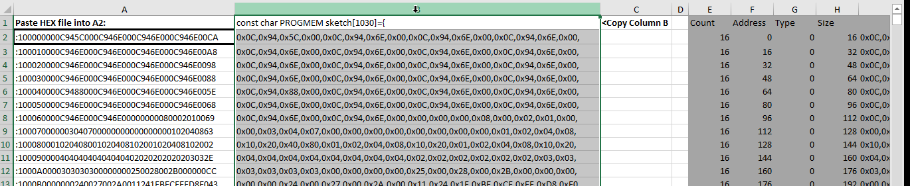

Then select all of column 'B' and replace the contents of the sketch.h tab with what has been copied. We have tested this with a few small sketches and it seems to work OK.

## Improvements:

Although this function may be of limited use, it is possible to program the Duinotech Uno Programmer sketch to the target. In the sketch file, there are the lines:

```c
if(progdata(sketch,sizeof(sketch))){      //included sketch
	//      if(progdata(0,32256)){                    //this sketch (entire flash)
		Serial.println("Write OK");
		digitalWrite(LED2,HIGH);
		if(verdata(sketch,sizeof(sketch))){     //included sketch
			//        if(verdata(0,32256)){                   //this sketch (entire flash)
```

If the two '//' commented lines are uncommented and the corresponding line immediately above is commented out, then the sketch will copy its entire flash memory to the target.

Another option will be to include multiple sketches onboard, so that the programmer can be used for multiple targets. If you find you are running out of flash memory, you can try using a Mega as the main board (although there are known bugs if more than 64k of non-code data is stored in the flash memory using PROGMEM).

One idea we thought of using was to put the hex files on an SD card and use this for storage, but we didn't get around to solving the issue of different devices sharing the SPI bus (it shouldn't normally be a problem, but the USB Host Shield and the Data Log Shield for the SD card both use pin 10 for SS, which would have necessitated modifying one of the shields.) In the end, the single sketch solution was all we needed, so we didn't pursue this further. Still, the idea of a portable programmer (perhaps with a small screen and some buttons) which could be loaded with all manner of sketches is very appealing.

As we noted before, the Mega and Leonardo use different protocols for upload, so this would have to be rewritten to take the protocols into account, although the USB device type should not need to change.
